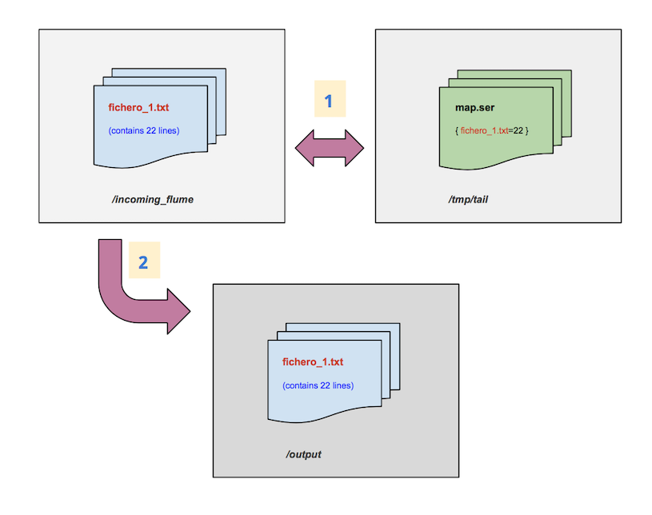

Taildirv2FilesShifter
=====================

### Objetivo ######
Utilidad que permite mover los ficheros que han sido procesados por [Keedio's Taildir-v2](http://github.com/keedio/taildir-v2)

### Descripción ######
La "custom source" Taildir-v2 procesa ficheros localmente mediante Flume y guarda el estado de los ficheros procesados. Taildirv2FilesShifter monitoriza
el estado de los ficheros procesados y los compara con los ficheros que permanecen en el "incoming" de flume para moverlos a directorio especificado.
Está pensado como solución para ficheros "batch" que una vez que se encuentran en el incoming de flume no cambian con el tiempo.



### Compilación y empaquetado ######
```
mvn clean package
```

### Uso de la utilidad ###
1. **Se requiere de tres argumentos para el uso de la utilidad:**

 ```
 $  java -cp /opt/Taildirv2FilesShifter-0.1-SNAPSHOT.jar org.keedio.flume.util.taild2.Taildirv2FilesShifter
  /ruta_a_ficheros_que_consume_flume
  /ruta_a_ficheros_donde_se_guarda_el_estado_de_taildir (la propiedad pathtoser de taildir2)
  /ruta_donde_queremos_mover_los_ficheros.
 ```

2. **¿Qué ficheros serán movidos?**

Aquellos ficheros que estando en "incoming" de flume tengan el mismo número de líneas y nombre que los ficheros
que se encuentran alamacenados en los ficheros de estado.

3. **¿Cuando se ejecuta?**

Está pensanda para ejecutar en paralelo con Taildir-v2 y de modo independiente y asíncrono.


### Observaciones ###
NO se recomienda el uso para soluciones de streaming de ficheros.

### Ejemplo de ejecución y trazas ###
```
java -cp /opt/Taildirv2FilesShifter-0.1-SNAPSHOT.jar org.keedio.flume.util.taild2.Taildirv2FilesShifter /home/zipi/cdr /tmp/tail /home/zipi/final

2017-12-12 10:41:02 [main] INFO  Taildirv2FilesShifter:30 - Watching path :/tmp/tail
2017-12-12 10:41:06 [main] INFO  Taildirv2FilesShifter:64 - Created: map_rt.ser
2017-12-12 10:41:07 [main] INFO  Taildirv2FilesShifter:148 - originalFilesMap: {}
2017-12-12 10:41:07 [main] INFO  Taildirv2FilesShifter:149 - processedFilesMap: {}
2017-12-12 10:41:07 [main] INFO  Taildirv2FilesShifter:154 - No more files processed, nothing to move
....
2017-12-12 10:42:10 [main] INFO  Taildirv2FilesShifter:74 - Modified: map_gp.ser
2017-12-12 10:42:10 [main] INFO  Taildirv2FilesShifter:148 - originalFilesMap: {/home/zipi/cdr/fichero_1.txt=31}
2017-12-12 10:42:10 [main] INFO  Taildirv2FilesShifter:149 - processedFilesMap: {/home/zipi/cdr/fichero_1.txt=31}
2017-12-12 10:42:10 [main] INFO  Taildirv2FilesShifter:158 - Moving file /home/zipi/cdr/fichero_1.txt to /home/zipi/final
2017-12-12 10:42:10 [main] INFO  Taildirv2FilesShifter:74 - Modified: map_gp.ser
2017-12-12 10:42:10 [main] INFO  Taildirv2FilesShifter:148 - originalFilesMap: {}
2017-12-12 10:42:10 [main] INFO  Taildirv2FilesShifter:149 - processedFilesMap: {/home/zipi/cdr/fichero_1.txt=31}
2017-12-12 10:42:10 [main] INFO  Taildirv2FilesShifter:154 - No more files processed, nothing to move
``


www.keedio.com

